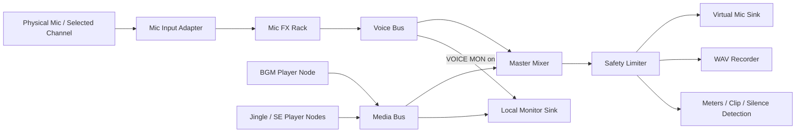

# ON AIR Deck: LIVE / REC / OSS 実装計画

更新日: 2026-08-11  
状態: Option 2を採用し、v2.0 Previewの中核機能を実装済み。OSS安定版の公開前検証は継続。

## 0. 現在地（v2.0 Preview）

実装済み:

- 同格の`LIVE / REC`起動選択と、選択モードに連動する操作卓
- RECのワンクリック開始、停止、48 kHz / 24-bit / stereo WAV保存、結果画面
- LIVE中のバックアップWAV録音
- マイク専用`OFF / SLAP / ECHO / BIG TITLE`と55%以下の安全なFeedback
- 標準ONのマイク専用`76 COMP`と、VOICE欄からの即時バイパス
- マスターPeak Limiter後段のWAV収録
- 12パッド、BGMキュー、ドラッグ＆ドロップ、波形、マイクメーター、VOICE MONの新UIへの統合

OSS安定版までの残作業:

- 60分以上の連続録音、デバイス抜き差し、スリープ復帰の耐久試験
- 録音中の空き容量監視、異常終了時の復旧、無音／クリップ／切断警告
- ローカル監聴と配信／録音再生元を完全に一つへ統合
- Meet／OBSを含む送出先ガイド、モニター出力デバイス選択
- 音源ライセンス整理、Developer ID署名、notarization、クリーンMac検証

## 1. 製品の約束

ON AIR Deckは、音響設定に詳しくないポッドキャスターやPC配信者が、OBS、外部オーディオインターフェース、複雑な仮想オーディオ設定なしで、本物のラジオのような演出を使えるmacOSアプリにする。

起動時に二つの用途を同格で提示する。

- `LIVE`: マイク、BGM、ジングル、SE、声エフェクトをZoom、Google Meet、OBSなどへ一つの入力デバイスとして送る。
- `REC`: 同じ演出を使いながら、このアプリだけで48 kHz / 24-bit / stereo WAVへ録音する。

### 1分の成功条件

- 共通: 初見利用者が、次に何を設定し、どのボタンを押すか理解できる。
- REC: 起動から1分以内に物理マイクの入力を確認し、`REC`を押して録音を開始できる。
- LIVE: 起動から1分以内に、物理マイク、BGM、ジングルが配信アプリ側へ入力されていると確認できる。

初回の管理者認証やmacOSの権限ダイアログはアプリから時間を制御できないため、`画面を見て迷っている時間`を最小化し、各外部操作を一つずつ案内する。

## 2. v2公開版の範囲

### 必ず入れる機能

1. 起動時の`LIVE / REC`モード選択
2. モード別の1分セットアップ
3. 物理マイク、BGM、パッドを一つにまとめる共通オーディオグラフ
4. RECモードのWAV録音、停止、確実な保存
5. LIVEモードの仮想マイク送出
6. LIVE中のバックアップWAV録音
7. マイク専用のディレイ／エコー
8. ヘッドホン監聴と出力先選択
9. マスター安全リミッター、クリップ警告、無音警告
10. 録音中の空き容量監視と中断ファイルの復旧
11. Zoom／Meet／OBSごとの設定ガイド
12. 音源ドラッグ＆ドロップ、BGMライブラリ、パッド、フェード、緊急停止など現行機能の維持

### v2では作らないもの

- 波形編集、カット、ノイズ除去などのDAW機能
- クラウド録音、番組配信、RSS公開
- VST／Audio Unitプラグインホスト
- Windows版
- 複数人の別トラック録音

完成したWAVをLogic Pro、Audition、DaVinci Resolveなどへ渡すところまでを責務にする。

## 3. 起動と画面構成

### Mode Select

起動直後に、同じ大きさの二枚のカードを表示する。

- `LIVE BROADCAST` — Zoom / Meet / OBSへ送る
- `STUDIO RECORDING` — WAVをこのMacへ録る

前回モードを強調するが、毎回選択可能にする。設定後も上部の`LIVE / REC`スイッチから切り替えられる。ただしON AIR中または録音中の切り替えは禁止し、終了操作を案内する。

### 共通Studio画面

既存のDJコンソール表現を維持し、三つの領域に整理する。

1. `TRANSPORT`: モード、主ボタン、状態、時間、緊急停止
2. `PERFORMANCE`: 12パッドとBGMデッキ
3. `VOICE / MASTER`: マイク、入力メーター、MIC FX、モニター、マスター、ダッキング

### LIVEで変わる部分

- 主ボタン: `ON AIR`
- 状態: `DESTINATION CONNECTED / NOT CONNECTED`
- 出力: `ON AIR Deck Virtual Mic`
- 補助操作: `BACKUP REC`
- ガイド: Zoom、Google Meet、OBS、その他から選択

### RECで変わる部分

- 主ボタン: `REC`、録音中は`STOP & SAVE`
- 状態: 録音時間、推定ファイルサイズ、空き容量、保存先
- 出力: `48 kHz / 24-bit / Stereo WAV`
- 仮想マイクとドライバ情報は隠す

### 録音終了画面

- ファイル名、保存先、長さ、容量
- `Finderで表示`
- `名前を変更`
- `もう一度録る`
- `完了`

編集機能は置かない。

## 4. 音声アーキテクチャ

現行実装は、手元で鳴らす`AVAudioPlayer`と仮想マイクへ送る`AVAudioEngine`が別々に再生している。このまま録音を追加すると、手元、Zoom、WAVで開始位置や音量がずれる。次版では再生元を一つに統合する。

### 設計原則

- 仮想マイクとWAVは、リミッター後の同じマスターバスを受け取る。
- マイクFXは声だけに作用し、BGMとパッドへは作用しない。
- BGMとパッドは常にローカル監聴できる。
- 自分の声はヘッドホン監聴がONのときだけローカルへ返す。
- 48 kHz stereoを内部標準にし、多チャンネル入力は選択した1chを中央定位へ変換する。
- デバイス変更時に黙って別マイクへ切り替えず、LIVE／録音状態を維持しながら明確な警告を出す。

### コード分割

- `StudioAudioGraph`: すべての音源、バス、リミッター、メーターを所有
- `MicrophoneInput`: デバイス列挙、UID保存、多チャンネル選択、再接続
- `VirtualMicSink`: HALドライバへの送出だけを担当
- `MonitorSink`: 物理出力とヘッドホン監聴を担当
- `RecordingService`: WAV開始、書き込み、停止、復旧を担当
- `MicEffectRack`: FXプリセットとパラメータを担当
- `SessionCoordinator`: LIVE／REC、開始／停止、エラー状態を管理
- `DeckStore`: パッドとBGMライブラリを引き続き担当

現在の`AudioController.swift`と`VirtualBroadcastEngine.swift`を直接肥大化させず、上記へ段階的に分割する。

## 5. WAV録音

### 固定仕様

- WAV / Linear PCM
- 48,000 Hz
- 24-bit
- Stereo
- 録音対象: リミッター後の最終ミックス
- ファイル名: `ON-AIR-Deck_YYYY-MM-DD_HH-mm-ss.wav`
- 初期保存先: `~/Music/ON AIR Deck Recordings`

開始前に保存ダイアログを出すと1分条件を壊すため、既定フォルダへ即座に録音し、終了後に名前変更や移動を行う。

### 安全設計

- 録音開始は一度のクリックで行う。
- 録音中はウインドウを閉じようとしても確認を出す。
- 一時ファイルとセッションメタデータを持ち、異常終了後に復旧候補を表示する。
- 空き容量を録音前と録音中に確認する。
- 同名ファイルを上書きしない。
- 書き込み失敗時はON AIRや再生を止めず、録音だけのエラーとして明示する。
- LIVEモードでも任意に同じマスターをバックアップ録音できる。

24-bit stereoは約1 GB/時になるため、UIに残り録音可能時間を表示する。

## 6. マイクエフェクト

初期実装は`AVAudioUnitDelay`を使い、マイクバスだけに挿入する。

### プリセット

- `OFF`: 原音
- `SLAP`: 短いタイトルコール向け
- `ECHO`: 標準的な反復
- `BIG TITLE`: 長めで派手な番組タイトル向け

### UIと挙動

- VOICEチャンネルに大きな`MIC FX`ボタンと点灯状態を置く。
- 1クリックまたは割り当て可能なホットキーでON／OFF。
- ポップオーバーでプリセット、MIX、FEEDBACKを変更。
- FEEDBACKには安全上限を設け、自己発振させない。
- OFFへ戻しても自然なエコーの余韻を残し、緊急停止では即座にテールを切る。
- FXの結果はLIVE、WAV、VOICE MONで一致させる。

## 7. 見逃しやすいが公開前に必要な機能

### P0: OSS公開前に入れる

- マスター安全リミッター
- クリップ／無音／マイク切断の警告
- 出力デバイス選択とヘッドホン確認
- LIVEのローカルバックアップ録音
- ZoomのOriginal Sound、MeetのノイズキャンセルOFFなど、送出先別ガイド
- 仮想マイクが外部アプリから使用中かを示す接続状態
- 長時間録音の空き容量表示と異常終了からの復旧
- 音源ライセンスと出所の明示

### P1: 公開後の短期ロードマップ

- 声を検出してBGMを下げるボイス・ダッキング
- 編集用マーカーとサイドカーJSON
- Mic / BGM / Padsのステム同時録音
- 番組ごとのデッキ／FXプリセット
- ホットキーのカスタマイズ
- 録音後のLUFS／ピーク解析

### P2: 将来

- Windows版
- 複数マイクの個別トラック
- MIDIコントローラー／Stream Deck対応
- プラグイン拡張

## 8. 実装フェーズ

### Phase 0: 仕様固定と視覚設計

- 本計画を承認する。
- Mode Select、LIVE、REC、録音終了、MIC FXの画面状態を設計する。
- 現行の暗い放送卓デザインを基準に、3案を比較して一つに固定する。
- 画面ごとのコピー、キーボード操作、エラー状態を確定する。

完了条件: 実装中に主要導線を作り直さなくてよい状態。

### Phase 1: 共通オーディオグラフ

- 現行の二重再生を一つのソースグラフへ置き換える。
- Voice / Media / Masterバスを導入する。
- ローカル監聴、仮想マイク、メーターを新グラフへ移す。
- 既存のBGM、パッド、フェード、ダッキング、多chマイクを回帰テストする。

完了条件: 1.0.6の全機能が新グラフで動き、仮想入力と手元監聴のサウンドが同期する。

### Phase 2: モードとセットアップ

- `LIVE / REC`起動画面を追加する。
- モード別トランスポートと状態管理を追加する。
- マイク権限、入力メーター、ドライバ、送出先を対話式に確認する。
- Zoom / Meet / OBSの設定ガイドを追加する。

完了条件: 初見テストで、両モードとも次の操作を説明なしで選べる。

### Phase 3: WAV録音

- `RecordingService`とマスタータップを実装する。
- REC、STOP & SAVE、結果画面、Finder表示を実装する。
- 空き容量、上書き防止、異常終了復旧、終了確認を実装する。
- LIVEのBACKUP RECを追加する。

完了条件: 60分録音が破損せず、声、BGM、パッドが48 kHz / 24-bit stereo WAVへ入る。

### Phase 4: MIC FX

- ディレイノード、プリセット、安全上限を実装する。
- MIC FXの操作、ホットキー、余韻、緊急停止を実装する。
- LIVE、REC、VOICE MONの一致を検証する。

完了条件: FXが声だけにかかり、BGMとSEの波形・レベルを変えない。

### Phase 5: 公開品質

- リミッター、クリップ／無音／切断警告を追加する。
- 文字サイズ、コントラスト、フォーカス順、VoiceOver、キーボード操作を改善する。
- 2時間耐久、デバイス抜き差し、スリープ復帰、ディスク枯渇をテストする。
- macOS 14以降、Apple Silicon、Intelで確認する。

完了条件: 主要な放送事故と録音消失を再現テストで防げる。

### Phase 6: OSSと配布

- `on-air-deck`を`harbor`親リポジトリから分離し、専用Gitリポジトリにする。
- アプリ本体のLICENSE、CONTRIBUTING、CODE_OF_CONDUCT、SECURITY、PR／Issueテンプレートを追加する。
- Appleサンプルコードのライセンスを維持する。
- 同梱BGM／SEの権利を監査し、再配布条件が不明な素材はCC0または自作素材へ差し替える。
- 個人の絶対パス、ユーザー音源、署名情報、開発用環境変数を除去する。
- テスト用GitHub Actionsを追加する。
- アプリ、HAL Driver、Installer PKG、DMGを署名し、notarize・stapleする。
- クリーンなmacOSユーザーでインストール、起動、録音、Zoom入力、アンインストールを確認する。

現状はPKGコンテナ署名とnotarizationが未完了なので、公開配布にはDeveloper ID Installer証明書の準備が必要。

## 9. テストと検収

### 自動テスト

- 多chマイクの選択chが中央定位へ変換される。
- BGM、パッド、マイクのミックス音量が期待値になる。
- FXがMicバスだけへ作用する。
- 仮想マイクと録音WAVを時間合わせした相関が一致する。
- WAVのsample rate、bit depth、channel count、durationが正しい。
- 開始／停止連打、モード切替、デバイス切断でも状態機械が破綻しない。
- ライブラリ保存、移行、壊れた音源を安全に扱う。

### 実機テスト

- MacBook内蔵マイク、USBマイク、Universal Audioの1ch／多ch入力
- Zoom、Google Meet、OBS
- BGM再生中の声、パッド連打、FX切替、オートダック
- 2時間のLIVE＋バックアップ録音
- マイク／ヘッドホンの抜き差し、サンプルレート変更、スリープ復帰
- 空き容量不足、保存権限エラー、アプリ強制終了からの復旧
- Intel / Apple Silicon、macOS 14 / 15 / 16

### リリース判定

- REC: 初見利用者が1分以内にREC開始。
- LIVE: 初見利用者が1分以内にマイク、BGM、ジングルの外部入力を確認。
- 録音WAVをLogic Pro、Audition、DaVinci Resolve、QuickTimeで開ける。
- LIVEの相手側とZoom録音で、声、BGM、SE、FXを確認。
- 署名、notarization、Gatekeeper、アンインストールをクリーン環境で確認。
- 重大な録音消失、無音出力、フィードバック、破損ファイルが0件。

## 10. 実装順の結論

`録音ボタン → エフェクト → 見た目`の順ではなく、次の順で進める。

1. 画面状態の固定
2. 音声グラフの統合
3. LIVE / RECモード
4. WAV録音
5. MIC FX
6. 放送・録音の安全機能
7. デザインとアクセシビリティの最終調整
8. OSS素材権利、署名、notarization、クリーン環境検収

この順序なら、声、BGM、パッド、FXが、手元、Zoom、録音で別々になる問題を構造的に防げる。
