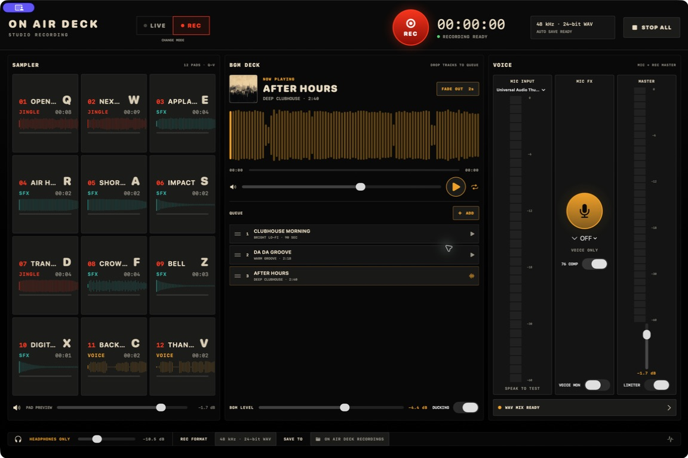

# ON AIR Deck

**ポッドキャスト、ラジオ収録、ライブ配信のための、macOSネイティブ放送卓です。**

[English](../README.md) · [简体中文](README.zh-Hans.md) · [한국어](README.ko.md)



ON AIR Deckは、マイク、BGM、ジングル、効果音を、一つの48 kHzオーディオグラフでミックスします。

`LIVE`では、同梱の仮想マイクを通して、Zoom、Google Meet、OBSへミックスを送れます。

`REC`では、同じ演奏を48 kHz／24-bit／stereo WAVへ直接録音できます。

外部オーディオインターフェース、BlackHoleの配線、OBSの構築、Zoomのコンピューター音声共有は不要です。

## 主な機能

- `LIVE`と`REC`を同格で選べる起動フロー。
- ワンクリックWAV録音と、LIVE中のバックアップ録音。
- `ON AIR Deck`という名前で表示される専用仮想マイク。
- 波形生成とキーボードショートカットに対応した、ドラッグ＆ドロップ式12パッド。
- 検索、ループ、2秒フェードに対応した、永続BGMライブラリ。
- 声だけに適用する`SLAP`、`ECHO`、`BIG TITLE`。
- 標準ONで、いつでも切り替えられる、控えめな76系ボイスコンプレッサー。
- BGMダッキング、最終段Peak Limiter、独立モニター、リアルタイムレベルメーター。
- 多チャンネルオーディオインターフェースの入力チャンネル選択。
- 日本語、英語、簡体字中国語、韓国語のUI。
- Apple SiliconとIntel MacのUniversal Binary。

## 動作条件

- macOS 14以降。
- ボイスモニターを使う場合は、有線ヘッドホンを強く推奨します。
- 仮想オーディオドライバのインストールと削除には、管理者権限が必要です。
- 公開配布版の署名と公証には、Developer ID Application証明書とDeveloper ID Installer証明書が必要です。

## このMacへ録音する

1. ON AIR Deckを開き、`REC`を選びます。
2. 実際に話すマイクを選びます。
3. `REC`を押します。
4. BGM、ジングル、効果音、マイクFXを使って収録します。
5. 停止後、保存したWAVをFinderで表示します。

既定の保存先は`~/Music/ON AIR Deck Recordings`です。

## Zoom、Meet、OBSへ送る

1. 署名済み配布物の`ON AIR Deck Audio Driver.pkg`をインストールします。
2. ON AIR Deckを開き、`LIVE`を選びます。
3. 実際に話すマイクを選びます。
4. 配信先アプリのマイクに`ON AIR Deck`を選びます。
5. 声とパッドを鳴らし、配信先アプリで両方の入力メーターが動くことを確認します。

Zoomで音楽の音質を優先する場合は、ミュージシャン用のオリジナルサウンドを使用してください。

## ソースからビルドする

[XcodeGen](https://github.com/yonaskolb/XcodeGen)をインストールし、次を実行します。

```bash
xcodegen generate
./scripts/test.sh
```

仮想オーディオドライバは、`AudioDriver/`の別Xcodeプロジェクトです。

ドライバのインストールは`/Library/Audio/Plug-Ins/HAL`を書き換えるため、テスト前にREADMEとパッケージスクリプトを確認してください。

## 公開準備状況

バージョン2.1では、2.0のLIVE／REC構成へ4言語対応を追加しました。

アプリとドライバはローカルでビルドでき、アプリの自動テストは成功しています。

公開配布には、同梱音源と画像の権利確認、Developer ID署名、Apple公証、クリーンなMacでの検証が残っています。

現在の状態は[OSS公開チェックリスト](OSS_RELEASE_CHECKLIST.md)に記録しています。

## ライセンス

ON AIR Deckのソースコードは、ルートの[`LICENSE`](../LICENSE)に記載したMIT Licenseで公開します。

`AudioDriver/`内のApple由来コードには、同梱されたAppleのMITライセンス表示が継続して適用されます。

同梱音源と画像は別管理の素材であり、プロジェクトのMIT Licenseが自動的に適用されるものではありません。
再配布前に[`THIRD_PARTY_NOTICES.md`](../THIRD_PARTY_NOTICES.md)と[素材台帳](ASSET_LEDGER.md)を確認してください。
